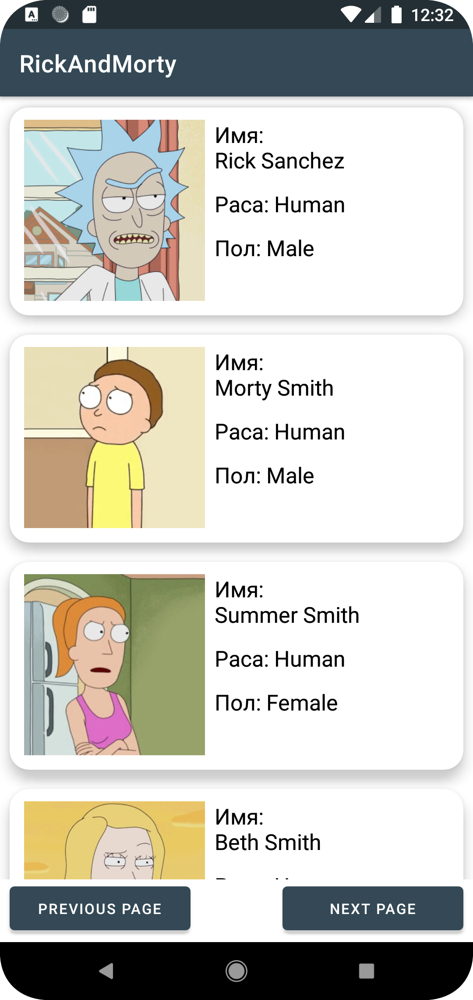
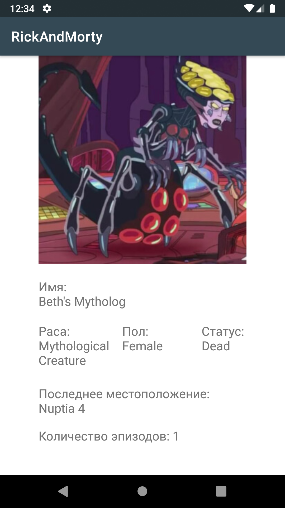

# RickAndMorty
## Возможности приложения:  
*  загрузка данных с API https://rickandmortyapi.com/ и отображение в RecyclerView;
*  постраничная загрузка осуществляется при помощи кнопок Next Page и Previous Page
*  при тапе на ячейке списка открывается новое активиту с детальной инофрмацией о персонаже
*  при отсутствии интернета вывод соответствующего Toast
### Используемые инструменты и библиотеки
*  Приложение разработано на языке Kotlin 
*  Retrofit для взаимодействия с REST API сайта
*  Picasso для загрузки изображений
*  Coroutines для асинхронной загрузки данных
*  Попытка реализовать архитектуру MVVM
### Скриншоты

